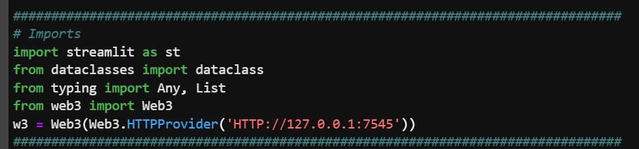
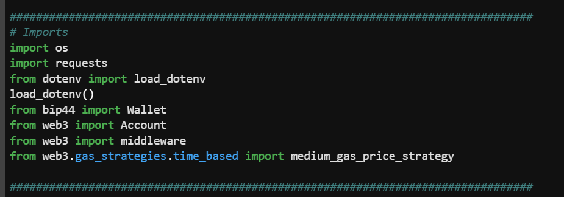
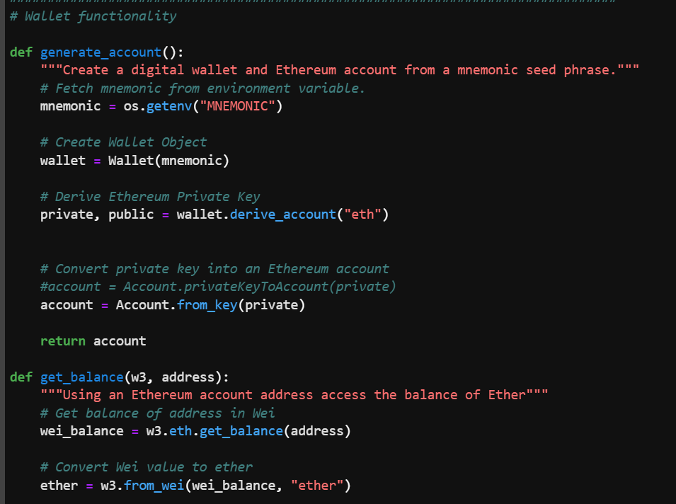
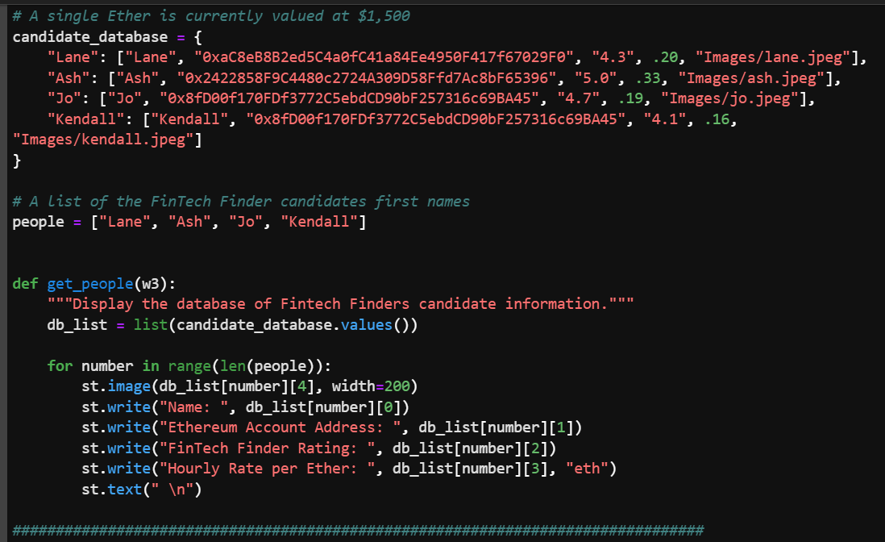
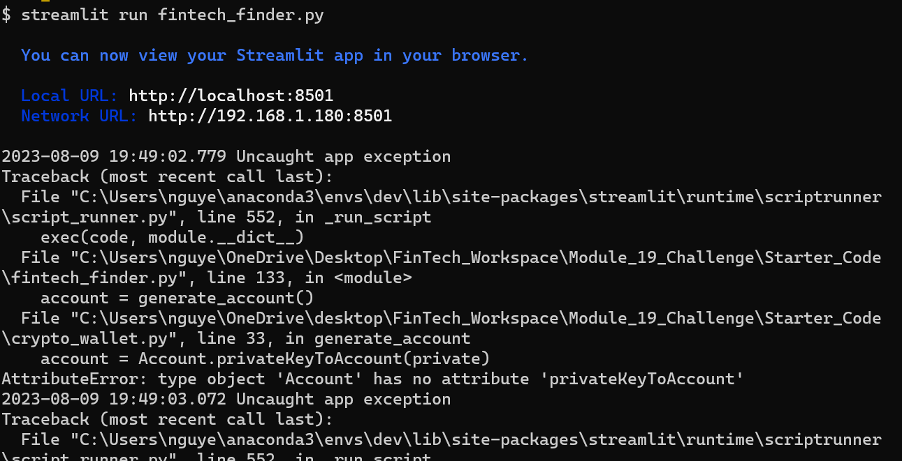
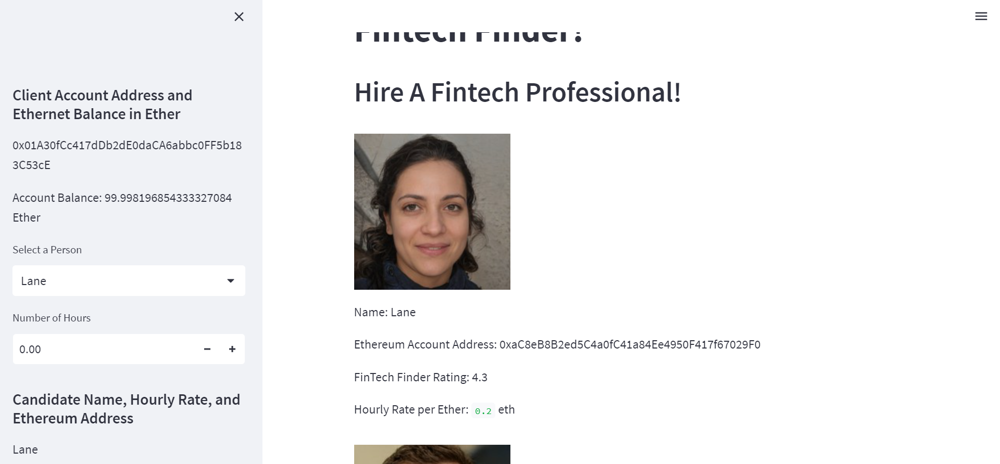

# Module_19_Challenge

Hello, this project is about building a new and disruptive platform called Fintech Finder. Fintech (financial technology) has been revolutionizing the financial industry, and creating a platform that helps users find innovative fintech solutions could have significant potential. 

---

## Technologies

pandas is a software library written for the Python programming language for data manipulation and analysis. Python is a computer programming language often used to build websites and software, automate tasks, and conduct data analysis.
## Installation Guide

---

## Usage

Use Plots and data frame to get the correct portfolio

---

## Contributors

-Name: John Nguyen
-Email: nguyenjohn1337@gmail.com

---

## License

Specify the details of your project’s license - that is, how others can or cannot use your code and files.
